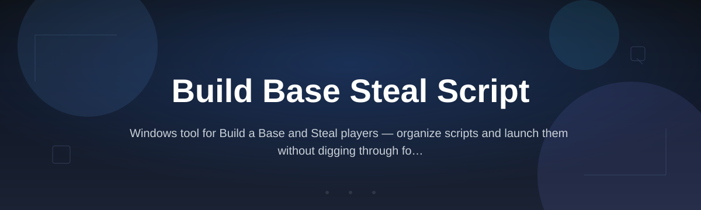
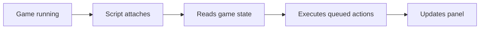

# build-a-base-script-hub

*A no-nonsense Build a Base and Steal script for players who'd rather build the base than babysit it.*

## What you can do

- **Auto-collect resources** across zones without walking there yourself.
- **Queue base upgrades** so materials get spent the moment they're available.
- **Track raid timers** and warn you before someone touches your loot.
- **Auto-place defenses** in the layout you actually want, not a random one.
- **Batch-steal runs** that hit multiple targets in one sitting.
- **Save layouts** so you're not rebuilding your base from scratch every wipe.
- **Toggle everything mid-match** — no restart, no reload, no drama.
- **Run silently in the background** while you do literally anything else.

## What this is

`build-a-base-script-hub` is a standalone script for the Build a Base and Steal game genre — the loop where you fortify a base, raid other players', and grind resources to stay ahead. This repo hosts the download entry point and the documentation for the script itself, not the game.

The script exists because the manual version of this loop is repetitive: same clicks, same waiting, same base you rebuild after every wipe. This tool handles the repetitive part — resource pickup, upgrade queuing, layout memory — so your actual playtime goes toward decisions, not chores. It's built for one game family, kept intentionally narrow, and updated when that game changes.

  

The button opens the project's landing page, where you download the current build.

## Who it is for

- Players who've played the same base-and-steal loop for 40+ hours and want the boring parts gone.
- Solo builders who don't have a squad to cover raids while they're offline.
- Anyone who's rebuilt the same base layout by hand more than twice.
- Streamers who need the grind to stay in the background, not the foreground.
- Players coming back after a break who don't want to relearn the manual loop.

## Getting started

1. Open the landing page from the download button above.
2. Grab the latest build listed there — it's versioned, so you know what you're running.
3. Extract it to any folder on Windows. No installer, no setup wizard.
4. Launch the `.exe` and point it at your game window.
5. Toggle the features you want from the on-screen panel.

## Requirements

- Windows 10 or 11 (64-bit).
- No Python, no Node, no build tools — it's a compiled standalone.
- A few hundred MB of free disk space.
- The target game installed and running locally.

## How it works

The script sits alongside the game process and reacts to what's on screen and in memory-safe reads, rather than modifying the game itself.

1. You launch the game, then the script.
2. The script identifies the running window and confirms compatibility.
3. It reads current base state — resources, timers, layout.
4. Your enabled features act on that state automatically.
5. The panel shows live status so you always know what's running.

<strong>FAQ</strong>

**Is this a Build a Base and Steal script or a full game replacement?**
It's a script that runs alongside the game. The game stays the game; this just automates the repetitive parts of the loop.

**Will this get my account flagged?**
Any automation carries risk in any online game. We can't promise otherwise — use your own judgment about what's acceptable for the game you're playing.

**Does it work on Mac or Linux?**
No. This build targets Windows 10/11 only. There's no Mac or Linux version planned right now.

**Do I need to reinstall it after every game update?**
Usually not — check the landing page first. If the game changes its structure significantly, a new build gets posted there.

**Can I run this on a fresh Windows install with nothing else set up?**
Yes. It's standalone. No toolchain, no runtime install, no dependencies to chase down first.

<strong>Troubleshooting</strong>

**The script won't detect the game window.**
Make sure the game is running in windowed or borderless mode before you launch the script, and that it's not running as administrator while the script isn't (or vice versa — match the privilege level).

**Features toggle on but nothing happens in-game.**
The game may have updated its layout since your build was compiled. Check the landing page for a newer version.

**Windows Defender or SmartScreen blocks the launch.**
This is common for unsigned standalone executables. Choose "run anyway" if you trust the source, or check the landing page for signing status updates.

**The panel appears but resources aren't collecting.**
Confirm you're inside a match/session where collection is actually possible — some game states (menus, loading) intentionally block it.

## License

Released under the [MIT License](LICENSE). Use it, modify it, redistribute it — just don't claim you wrote the original. This project is provided as-is, with no warranty and no guarantee it stays compatible with every future game update.

  

